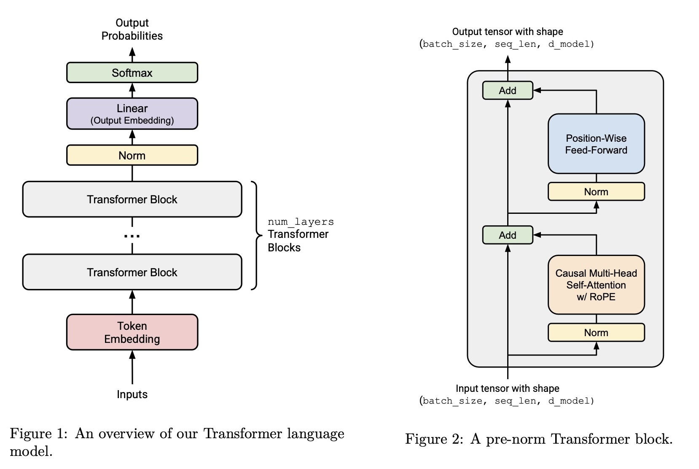

# A Transformer Implementation from Scratch

This repository contains a minimal from-scratch implementation of the Transformer architecture12 in PyTorch [^1][^2].

Every component—linear layers, embeddings, normalization, feed-forward blocks, and attention—was hand-built using torch.nn.Module, without relying on high-level shortcuts. The codebase is designed for clarity and includes extensive inline comments to aid understanding of the Transformer architecture.




### Repository structure 

```
model/
│         
├── transformer/             # Transformer components
│   ├── Attention.py         # Scaled Dot-Product attention and Multi-head self attention 
│   ├── Embedding.py         # Embedding module
│   ├── Linear.py            # Custom linear layer
│   ├── RMSNorm.py           # Root Mean Square LayerNorm
│   ├── SWIGLU.py            # SwiGLU activation
│   ├── Softmax.py           # Softmax layer
│   └── Transformer.py       # Transformer block and Language Model
|
├── training/                # Training utilities
│   └── Cross_entropy.py # Cross-entropy loss implementation
│   └── Training.py # cosie annealing schedule and gradient clipping
|   └── AdamW.py # AdamW implementation
|
├── tests/                    # Unit tests (39/39 passed)
│
├── README.md                 
├── pyproject.toml            # Dependencies & metadata
└── uv.lock                   # Lockfile for reproducibility          
```

### Quick Start

Setup 

```
git clone https://github.com/avakn5/Transformer-from-Scratch.git && cd model
pip install -e .
```

Run the transformer
```
import torch
from model.transformer.Transformer import TransformerLM

model_run = TransformerLM(
    vocab_size=10_000,
    context_length=16,
    num_layers=3,
    theta=10_000.0,
    d_model=64,
    d_ff=128,
    num_heads=4,
)
x = torch.randint(0, 10_000, (2, 12))   # [batch=2, seq=12]
logits = model_run(x)                       # [2, 12, vocab_size]
```

### STEPS to the Transformer implementation from scratch (sequential implementation):

* 1- Implement a linear module 
* 2- Implement an embedding module 
* 3- Implement a RMSNorm module
* 4- Implement a SWIGLU
* 5- Implement RoPE(Relative Positional Embeddings)
* 6- Implement softmax
* 7- Implement Self-Attention
* 8- Implement Multi-Head Attention
* 9- Implement Transformer block
* 10- Implement Transformer Language Model


### Implemented Features:

* Linear Module
* Embedding Module
* RMSNorm Module
* SWIGLU
* RoPE
* Softmax
* Scaled Dot Product Attention
* Causal MultiHead Self Attention

* Passing all 39/39 tests.

### Next Steps: 

* Add functionnality for config, reading hyper-parameters from a config.
* Load Llama 3.1 8B parameters checkpoints.
* Generate tokens from llama 3.1 8B.


[^1]: Stanford CS336: Language Modeling from Scratch — Assignment 1 Instructions. Stanford University, 2025. https://stanford-cs336.github.io/spring2025/ ↩
[^2]: Vaswani, A., Shazeer, N., Parmar, N., Uszkoreit, J., Jones, L., Gomez, A. N., Kaiser, Ł., & Polosukhin, I. (2017). Attention Is All You Need. NeurIPS. https://arxiv.org/abs/1706.03762 
